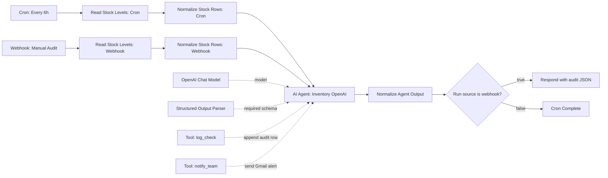

# NotebookLM Slide Source: Inventory Agent v2 Workflow

Use this document to generate a presentation about the n8n workflow `04_Inventory_Agent_OpenAI_Reliable_v2`.

Recommended deck title: **Inventory Agent v2: A Reliable Audit Agent for Stock Monitoring**

Primary audience: classmates, capstone evaluators, instructors, and non-technical stakeholders who need to understand the business value, system design, reliability controls, and test evidence.

Desired tone: clear, professional, engineering-focused, and practical. Avoid making it sound like a generic AI demo. Emphasize that v2 is a guarded, reliable audit agent rather than a fully autonomous purchasing agent.

---

## Image Assets To Upload With This Markdown

Upload these screenshots alongside this Markdown if NotebookLM supports separate source files. If images are inserted manually into slides, use the captions below.

1. `slide-assets/v2-n8n-workflow-list.jpg`
   - Caption: n8n workflow overview showing the cleaned inventory v2 workflow entry.
   - Suggested use: slide 2 or slide 10 as evidence that the final v2 workflow is preserved cleanly in n8n.

2. `slide-assets/v2-n8n-workflow-canvas.jpg`
   - Caption: Full n8n canvas for `04_Inventory_Agent_OpenAI_Reliable_v2`.
   - Suggested use: main architecture slide. This is the best screenshot for showing the whole workflow.

3. `slide-assets/v2-n8n-ai-agent-settings.jpg`
   - Caption: AI Agent settings showing the fixed prompt, normalized payload, decision matrix, and tool rules.
   - Suggested use: slide explaining the agent contract and reliability guardrails.

Markdown preview references:


---

## Executive Summary

Inventory Agent v2 is an n8n workflow that audits restaurant inventory data from Google Sheets, normalizes the latest stock row, asks an OpenAI-powered AI Agent to evaluate stock risk, logs every decision, and sends bounded email alerts only when low-stock thresholds are met.

The goal of v2 is not unrestricted autonomy. The goal is reliable audit automation: deterministic inputs, structured outputs, explicit tool contracts, and verified side effects.

The workflow monitors ingredients such as Flour, Cheese, Tomato Sauce, Beef, and Pasta. A valid item is considered low stock when `stock_kg < 20`. Low items are replenished conceptually to 50 kg, so `reorder_kg = 50 - stock_kg`.

---

## System Diagram



---

## Business Problem

Manual stock checking is repetitive and error-prone. A restaurant can miss reorder windows when stock drops quickly, but a poorly designed automation can create its own risk by treating blank data as zero, emailing the wrong people, or making untraceable decisions.

The v2 workflow solves the reliability layer first. It converts raw sheet data into a clean inventory payload before the AI Agent sees it, then forces the agent to follow a decision matrix and structured output schema.

---

## What Makes v2 More Reliable

1. **Input normalization before AI**
   - The workflow reads the actual `Weekly Data` sheet.
   - It converts wide spreadsheet columns such as `Flour (kg)` and `Cheese (kg)` into normalized objects like `{ item_name, stock_kg, last_updated, source_row }`.
   - Invalid or blank stock values are logged as invalid rows, not converted to zero.

2. **Explicit agent contract**
   - The agent must compute low-stock items from valid inventory rows only.
   - The agent must always call `log_check`.
   - The agent can call `notify_team` only when the decision matrix requires it.
   - Recipients are bounded to `warehouse` or `supplier`.

3. **Structured output parser**
   - The agent output is required to match a structured audit object.
   - This reduces the risk of free-form AI text breaking downstream workflow steps.

4. **Separated cron and webhook endings**
   - Cron runs finish at `Cron Complete`.
   - Webhook runs respond with JSON through `Respond`.
   - This avoids scheduled runs trying to return a webhook response.

5. **Audit trail**
   - Every run writes to `CheckLog`.
   - Logs include alert status, number of low items, low-stock JSON, invalid rows, actions taken, and run source.

---

## Agent Decision Matrix

The agent follows this fixed rule set:

| Condition | Required behavior |
|---|---|
| 0 low-stock items | Call `log_check` only. Do not email. |
| 1-2 low-stock items | Call `log_check`, then email warehouse. |
| 3+ low-stock items | Call `log_check`, email warehouse, then email supplier. |
| Invalid stock values | Include in `invalid_rows`; never treat as zero. |

Warehouse email: `data.msgbox@gmail.com`

Supplier email: `dmsgbox@gmail.com`

---

## Structured Output Shape

The workflow expects the agent to return:

```json
{
  "items": [],
  "low_stock_items": [],
  "invalid_rows": [],
  "alert_required": false,
  "actions_taken": [],
  "run_source": "cron"
}
```

This output shape makes the agent easier to test and safer to connect to downstream nodes.

---

## Test Evidence

Verified test outcomes:

1. Local v2 JSON validates with `jq`.
2. v2 uses OpenAI, not DeepSeek.
3. The workflow reads `Weekly Data` from Google Sheets.
4. The normalizer uses the latest weekly row.
5. The valid latest row had 0 low-stock items, so the production logic correctly logged only and did not send unnecessary email.
6. A temporary low-stock E2E test forced three normalized items below 20 kg after the sheet read, proving the email alert path.
7. Gmail sent warehouse and supplier alerts successfully in the E2E test.
8. A standalone supplier smoke-test email was sent successfully to `dmsgbox@gmail.com`.

Supplier smoke-test result:

- Gmail message id: `19e3665e30f59c10`
- Thread id: `19e3665e30f59c10`
- Label: `SENT`

Earlier v2 E2E email-path test:

- Warehouse Gmail message id: `19e36586eeb59dc6`
- Supplier Gmail message id: `19e36586da4576d8`
- Both returned `SENT`.

---

## Suggested Slide Outline

### Slide 1: Title

Title: **Inventory Agent v2: Reliable Audit Automation**

Subtitle: OpenAI + n8n + Google Sheets + Gmail for controlled inventory alerts.

Visual: Use a clean title slide with small system tags: Google Sheets, OpenAI Agent, Structured Output, CheckLog, Gmail.

Speaker point: This is not a chatbot. It is a workflow agent with bounded actions.

### Slide 2: The Operational Problem

Claim: Manual stock monitoring creates reorder risk, but naive automation creates false-alert risk.

Proof object: Three-part contrast:

- Manual checking is slow.
- Raw sheets can contain blanks or irregular columns.
- Autonomous emails must be bounded and logged.

Visual: Use `v2-n8n-workflow-list.jpg` as a small proof screenshot or use an icon row.

### Slide 3: Full Workflow At A Glance

Claim: v2 turns inventory monitoring into a traceable audit workflow.

Visual: Use `v2-n8n-workflow-canvas.jpg` full-width.

Callouts to add:

- Left: Cron or webhook starts the run.
- Center: OpenAI agent decides using normalized stock.
- Bottom: Tools are connected but bounded.
- Right: Cron ends cleanly; webhook responds with JSON.

### Slide 4: Input Normalization Before AI

Claim: The workflow makes data deterministic before the agent can act.

Content:

- Reads actual `Weekly Data`.
- Converts ingredient columns into normalized item rows.
- Preserves `source_row` for auditability.
- Logs blank or non-numeric stock as invalid instead of treating it as zero.

Visual: Show a before/after mini table:

Before: `Flour (kg)`, `Cheese (kg)`, `Tomato Sauce (kg)`

After: `item_name`, `stock_kg`, `last_updated`, `source_row`

### Slide 5: Agent Contract And Decision Matrix

Claim: The agent is action-capable, but not unrestricted.

Visual: Use `v2-n8n-ai-agent-settings.jpg`.

Content:

- The prompt gives strict operating rules.
- The decision matrix determines when to email.
- The agent must always log before notification.
- Recipients are limited to warehouse and supplier.

### Slide 6: Tooling Architecture

Claim: Tool calls are explicit, auditable, and purpose-specific.

Proof object:

| Tool | Purpose | Safety control |
|---|---|---|
| `log_check` | Append audit row to `CheckLog` | Always called once |
| `notify_team` | Send Gmail alert | Only called by matrix |
| Structured Output Parser | Enforce audit JSON | Prevents free-form output |
| OpenAI Chat Model | Reason over normalized payload | Temperature 0 |

### Slide 7: Alert Logic

Claim: v2 avoids unnecessary emails while still escalating real shortages.

Visual: Use a simple escalation ladder:

0 low items -> log only

1-2 low items -> warehouse alert

3+ low items -> warehouse alert + supplier alert

Speaker point: This is safer than letting the AI improvise who to contact.

### Slide 8: Testing Results

Claim: The workflow was tested across both no-alert and alert paths.

Content:

- Production latest row: no low items, log-only behavior.
- E2E forced low-stock scenario: three low items.
- Gmail returned `SENT` for warehouse and supplier.
- Supplier smoke test sent to `dmsgbox@gmail.com`.

Visual: Use a compact evidence table with message ids.

### Slide 9: Why This Is Agentic But Guarded

Claim: v2 is agentic in decision and tool use, but intentionally bounded in autonomy.

Agentic qualities:

- Interprets normalized stock context.
- Decides alert requirement.
- Chooses tool calls.
- Writes actions taken.

Guardrails:

- Fixed thresholds.
- Required logging.
- Structured output.
- Bounded recipients.
- No autonomous purchase orders.

Speaker point: This is the right level of autonomy for a reliability-first capstone prototype.

### Slide 10: Future Upgrade Path

Claim: v2 creates the reliable base for v3 planning and approval workflows.

Suggested v3 direction:

- Read recent `CheckLog` history.
- Detect repeated shortages.
- Draft reorder plans.
- Validate reorder quantities.
- Route supplier-facing purchases through human approval.

Close: Reliable audit first; guarded planning next; full autonomy only with approval and controls.

---

## Presentation Recommendations

Use the workflow canvas screenshot as the centerpiece. Do not overfill slides with screenshots; crop or annotate the screenshots with 2-4 callouts per slide.

Avoid saying the system is “fully autonomous.” A stronger and more defensible phrase is: **a guarded agentic audit workflow**.

Lead with reliability, not novelty. The strongest story is that v2 fixed practical automation risks: wrong sheet names, wrong columns, invalid stock values, webhook/cron mismatch, unstructured AI output, and unbounded tool inputs.

Use the email evidence carefully. The message IDs prove Gmail sent the test messages, but the audience does not need full logs. Put the IDs in a small proof table or appendix.

For a polished deck, use a three-color visual language:

- Green for valid data and successful log checks.
- Amber for low-stock warnings.
- Red only for supplier escalation or critical shortage.

Add one “What could go wrong?” slide if time allows. It makes the system look more mature:

- Blank stock should not become zero.
- Scheduled runs should not hit webhook response nodes.
- AI should not invent recipients.
- Supplier emails should not bypass approval in future reorder versions.

Suggested closing line:

> Inventory Agent v2 is not trying to replace human purchasing judgment. It makes inventory monitoring consistent, auditable, and ready for a safer planning layer.

---

## Appendix Notes For Q&A

Current v2 status:

- Main local workflow file: `04-inventory-agent-v2.json`
- n8n workflow name: `04_Inventory_Agent_OpenAI_Reliable_v2`
- AI model node: OpenAI Chat Model
- Alert threshold: valid `stock_kg < 20`
- Reorder target in prompt: 50 kg
- Audit sheet: `CheckLog`
- Stock source sheet: `Weekly Data`

Known limitation:

v2 sends supplier alerts automatically for 3+ low-stock items. It does not create purchase orders. If the system moves toward autonomous reorders, supplier-facing actions should use human approval first.

Best one-sentence definition:

**Inventory Agent v2 is a reliable audit agent that converts messy spreadsheet stock data into structured decisions, logs every run, and sends bounded alerts only when the rules require it.**
